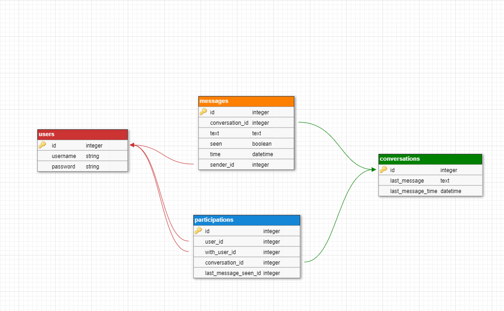
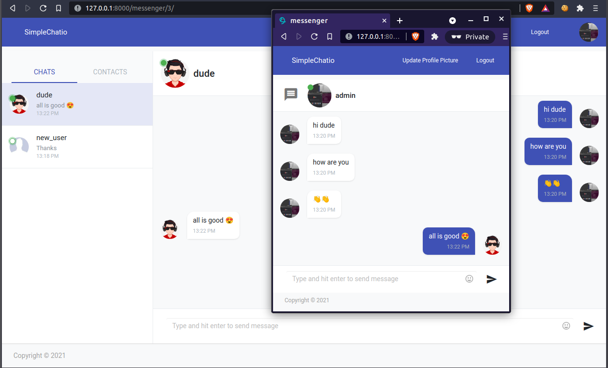

<p align="center">
  <h3 align="center">Simple Chat APP</h3>

  <p align="center">
   simple one to one private chat app built with django and nodejs socket.io.
  </p>


</p>

## About The Project
very simple chat app not for usage for sure or serving real world purpose but in the journey of building it i searched for alot of useful stuff related to django framework .
also open the world for me to study real world applications system design and how they work and scaling to serve million of users . 
also i tried to practice on optimizing database quering and using docker + docker-compose. 
#### it could be done using only django or node but i needed to build it with both just for practicing
and here some quick stuff in this project

- backend built with django .
- used mongodb and djongo library as ORM .
- using redis as chaching service to cache sessions and some repeated queries .
- nodejs server as socketio server .
- managed to implement socket authentication in nodejs using same session used in django .
- managed to dockerizing the app using docker-compose with redis/mongo/nginx/nodejs/django services .
- as backend dev i did my best for client-side logic and ui with help of simple vue-js and static html template . 


## database simple schema



## preview


### Usage

1. Clone the repo
    ```sh
    git clone https://github.com/civilcoder55/chatapp.git
    ```

2. Build docker images
    ```sh
    sudo docker-compose build 
    ```

3. Run docker containers
    ```sh
    sudo docker-compose up -d
    ```

4. open url in browser
    ```sh
    http://127.0.0.1:8000/messenger
<p align="center">
  
</p>


## TO DO

-   [ ] Adding fies/photo sharing .
-   [ ] Adding messages indicators .
-   [ ] writing tests .
-   [ ] Refactor some codes .
